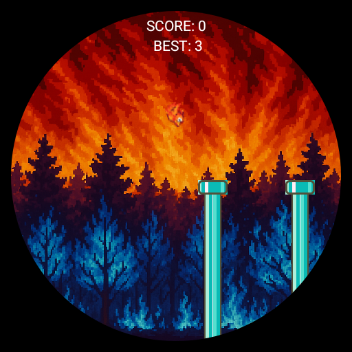
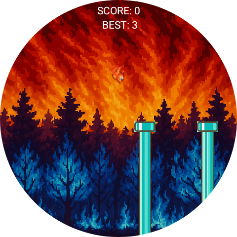

# Blaze Bird (App para WearOS)

## Descrição

Em Asas de Fogo, o desafio é simples para smartwatch com WearOs: toque para voar e desvie dos perigos incandescentes . Cada toque é um passo mais perto do caos (ou da glória). Gráficos quentes, ação rápida e muita raiva envolvida. Quantos pontos você consegue antes de virar cinzas?

## Tecnologias utilizadas

## Preview

